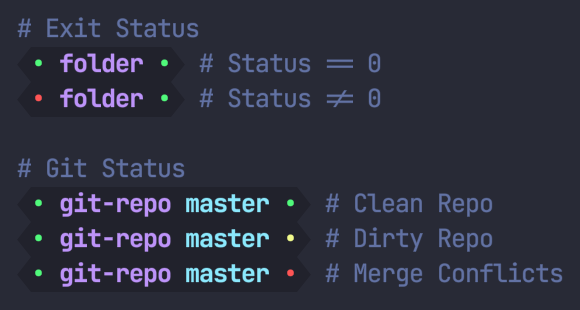

# Fish Prompt

A simple shell prompt for [`fish`](https://fishshell.com/), with exit status and
Git status indicators.



## Install

### With [Fisher](https://github.com/jorgebucaran/fisher):

```fish
fisher install jaminthorns/fish-prompt
```

### With [Oh My Fish](https://github.com/oh-my-fish/oh-my-fish):

```fish
omf install https://github.com/jaminthorns/fish-prompt
```
